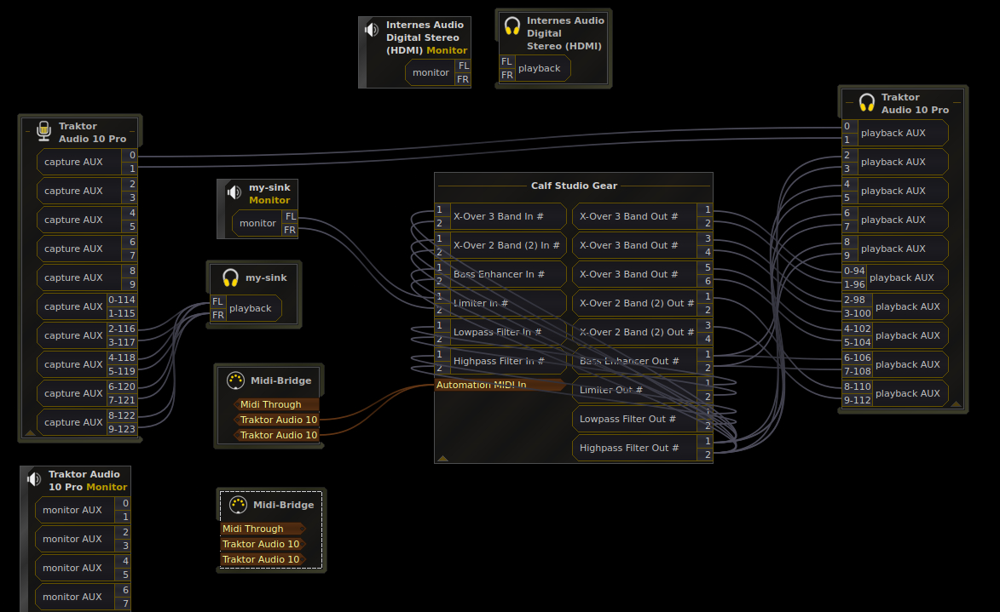

# rpi-frequenzweiche
Raspberry Pi sound mixer (20 inputs/outputs),

Used to separate the frequencies for the different types of speakers all accross the office. Special effects are applied to the audio and all parameters are controllable from a Allen&Heath Xone 1D midi fader. Running on a raspberry pi 4 with 2 Traktor Audio 10 soundcards.

